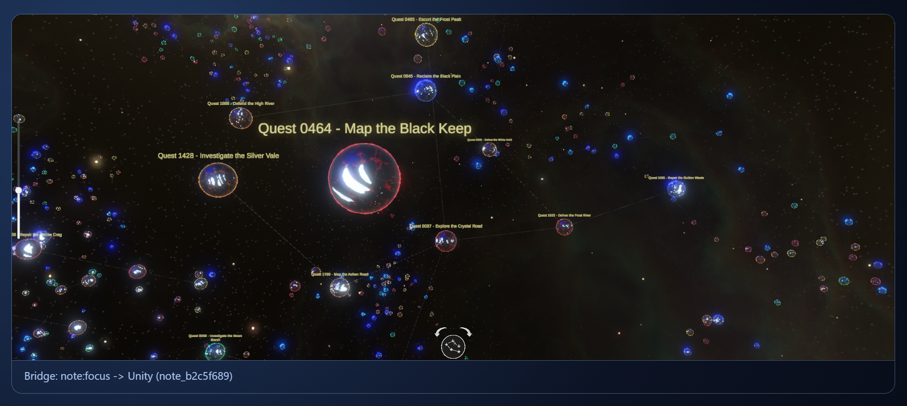

# ReverySky Map

ReverySky Map embeds a 3D Unity WebGL map view in Obsidian for inspecting vault structure. It builds the view from Markdown notes, resolved links, tags, note dates, and file metadata, then keeps the runtime in sync with the active filter and focused note.

## Installation

You can install ReverySky Map in one of two ways:

### Official release

Once ReverySky Map is available in Obsidian Community plugins, install it from Obsidian:

1. Open **Settings → Community plugins → Browse**.
2. Search for **ReverySky Map**.
3. Install and enable the plugin.

### Beta release via BRAT

You can also install the plugin via [BRAT](https://github.com/TfTHacker/obsidian42-brat):

1. Install and enable **BRAT** in Obsidian.
2. Add this beta plugin repository:

   `https://github.com/moonskorch/ReverySky-Plugin`

3. Enable **ReverySky Map** in Obsidian’s Community plugins settings.

## Opening the map

After enabling the plugin, you can open the map in either way:

- Click the left ribbon button **Toggle ReverySky Map**.
- Run **ReverySky Map: Open map** from the command palette.

## Navigation

- Pan: drag the map with the primary mouse button to move the camera focus across the current layout.
- Zoom: use the vertical slider on the left side of the map, or use the mouse wheel for quick zooming.
- Rotate: use the on-screen rotate controls, or hold the right mouse button and drag horizontally.
- Display mode: use the round view button to switch between the standard detailed rendering and a simplified rendering. In link layouts, the standard mode shows tag nodes and link lines; the simplified mode keeps note nodes visible and hides those extra details.
- Open a note: click a note node in the runtime. The map focuses that node and asks Obsidian to open the matching Markdown file.
- Follow the active note: when Obsidian focuses a Markdown note, the runtime can focus the matching node in the map.
- Date navigation: in the `Dates` layout, use the date slider to move along the time axis while keeping pan, zoom, and rotation available.

## Filter

Open the settings panel from the map view to limit which notes are sent to the runtime. The filter box supports:

- `path:` to match notes by vault-relative file path. Folder suggestions are built from the current vault data.
- `tag:` to match notes by tag. Tag suggestions use tags collected from Markdown metadata and frontmatter.
- `date:` to match note dates from `date`, `created`, or `created_at` frontmatter, with file creation time as a fallback. Supported forms include exact dates and comparisons such as `date:>=2026-01-01`.
- A leading `-` to exclude matches, such as `-path:Archive`.

Use `Escape` in the filter box to clear the query. Use the Tags switch to hide tag-derived map structure without changing the current path, date, or tag filter.

## Map Layout

The Map layout control changes how the same vault data is arranged:

- `Dynamic links`: a force-directed layout for link-heavy inspection in vault slices up to 500 notes.
- `Scalable links`: a more stable layout for larger vault slices and denser link maps.
- `Dates`: a chronological layout that arranges notes by date and enables the date slider.
- `Auto`: chooses `Dynamic links` for smaller datasets and switches to `Scalable links` above 500 notes.

## Runtime and source availability

The current release candidate build uses the `embedded-archive` package mode. Other package modes and release shapes are documented in [Packaging Modes](docs/PACKAGING_MODES.md).

The [Obsidian plugin source code](src/) and the [Unity project source code](unity/ReverySkyMap/) are available in this repository. 

Release assets are built and attested by GitHub Actions from tracked repository contents. To make that reproducible without running Unity Editor in GitHub Actions, the compact Unity WebGL runtime input under `unity-webgl/Build/runtime-*` is intentionally tracked after the local Unity export/import workflow.

The ReverySky Map WebGL view was built with Unity® software and includes Unity-generated WebGL runtime files. ReverySky Map is not sponsored by or affiliated with Unity Technologies or its affiliates. Unity and related Unity marks are trademarks or registered trademarks of Unity Technologies or its affiliates in the U.S. and elsewhere.

The standard Obsidian community plugin release shape is a small set of root release assets: `manifest.json`, `main.js`, and optionally `styles.css`. ReverySky Map also needs a Unity WebGL runtime, including Unity-generated JavaScript, WebAssembly, data files, and visual/runtime assets. To keep the release self-contained in that shape, the `embedded-archive` package mode stores the generated Unity WebGL build archive inside the released `main.js`.

The plugin does not download the Unity runtime from the network. On first map open, it extracts the embedded Unity WebGL archive into a versioned local cache inside the installed plugin folder:

`.obsidian/plugins/reverysky-map/.reverysky-runtime/<version>/`

Later launches reuse that cache. A local WebGL host reads the cached runtime files so the iframe can load Unity WebGL from `127.0.0.1`.

Vault notes are handled separately. The graph builder enumerates Markdown files through Obsidian's vault APIs and uses vault-relative paths plus metadata to build the map payload; the local runtime file access is not used to scan, read, or write vault notes, other user files, or system files outside the installed plugin folder.

If you rely on Obsidian Sync Standard to sync installed plugins, install or update ReverySky Map from the release assets on each device; that plan does not sync files over 5 MB.

See the third-party notices for bundled visual assets and runtime dependencies.

## License

Original source code and project-owned materials are licensed under the
[MIT License](LICENSE.md).

## Third-party visual assets

The built plugin uses several third-party visual assets. Their raw source files
are intentionally excluded from Git and must be added manually for local Unity
development.

See [third-party notices](unity/ReverySkyMap/Assets/ThirdPartyNotices.txt) and
[Unity setup instructions](unity/ReverySkyMap/Assets/README.txt).
