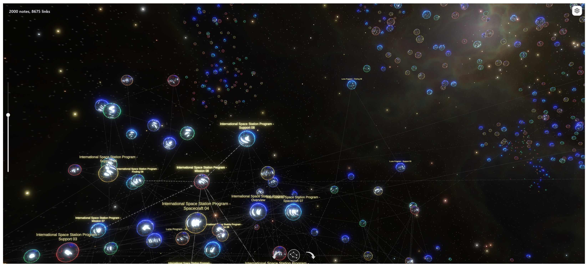
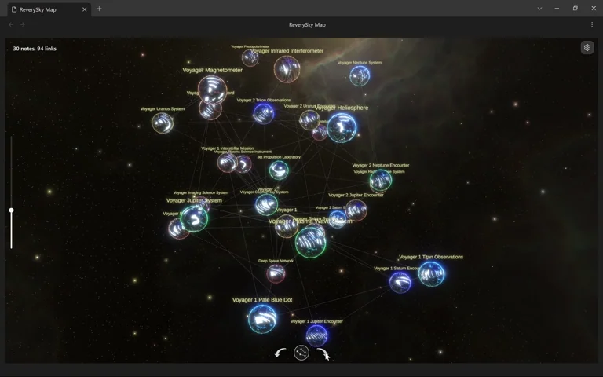

# ReverySky Map

ReverySky Map embeds a 3D Unity WebGL map view in Obsidian for inspecting vault structure. It builds the view from Markdown notes, resolved links, tags, note dates, and file metadata, then keeps the runtime in sync with the active filter and focused note.

## Requirements

- Obsidian 1.12.7 or later
- Desktop only
- WebGL-compatible graphics hardware and drivers

## Installation

Install [ReverySky Map](https://community.obsidian.md/plugins/reverysky-map) from Obsidian Community plugins.

## Opening the map

After enabling the plugin, you can open the map in either of two ways:

- Click the left ribbon button **Toggle ReverySky Map**.
- Run **ReverySky Map: Open map** from the command palette.

## Visual quality

Visual quality depends on your display resolution, screen scaling, graphics driver, and the GPU used by Obsidian. For the clearest image, keep your graphics driver up to date and let Obsidian use a high-performance GPU when your device offers one. On dual-GPU laptops, this is usually set in your system graphics settings.

You can also adjust Render Scale in the plugin settings: higher values sharpen the map but use more GPU power.

### Character support

Map note titles support Latin text with accents, Cyrillic text, common symbols, and monochrome emoji.

## Navigation

- Pan: drag the map with the primary mouse button to move the camera focus across the current layout.
- Zoom: use the vertical slider on the left side of the map, or use the mouse wheel for quick zooming.
- Rotate: use the on-screen rotate controls, or hold the right mouse button and drag horizontally.
- Display mode: use the round view button to switch between the standard detailed rendering and a simplified rendering. In link layouts, the standard mode shows tag nodes and link lines; the simplified mode keeps note nodes visible and hides those extra details.
- Open a note: click a note node in the runtime. The map focuses that node and opens the matching Markdown note in Obsidian.
- Follow the active note: when Obsidian focuses a Markdown note, the runtime can focus the matching node in the map.
- Date navigation: in the `Dates` layout, use the date slider to move along the time axis while keeping pan, zoom, and rotation available.

## Filter

Open the settings panel from the map view to limit which notes are sent to the runtime. The filter box supports:

- `path:` to match notes by vault-relative file path. Folder suggestions are built from the current vault data.
- `tag:` to match notes by tag. Tag suggestions use tags collected from Markdown metadata and frontmatter.
- `date:` to match note dates from `date`, `created`, or `created_at` frontmatter, with file creation time as a fallback. Supported forms include exact dates and comparisons such as `date:>=2026-01-01`.
- A leading `-` to exclude matches, such as `-path:Archive`.
- Filters can be combined, for example: `path:Projects tag:research -path:Archive date:>=2026-01-01`

Use `Escape` in the filter box to clear the query. Use the Tags switch to hide tag-derived map structure without changing the current path, date, or tag filter.

## Map layout

The Map layout control changes how the same vault data is arranged:

- `Dynamic links`: a force-directed layout for link-heavy inspection in vault slices up to 500 notes.
- `Scalable links`: a more stable layout for larger vault slices and denser link maps.
- `Dates`: a chronological layout that arranges notes by date and enables the date slider.
- `Auto`: chooses `Dynamic links` for smaller datasets and switches to `Scalable links` above 500 notes.

## Privacy, network, and local files

ReverySky Map processes vault structure locally on your device.

### Vault data

The plugin uses Obsidian's vault and metadata APIs to collect the information required to build the map:

- Markdown file paths and note titles
- Tags from note metadata and frontmatter
- Dates from the `date`, `created`, or `created_at` frontmatter properties, with file creation time as a fallback
- File sizes
- Resolved links between notes

The map payload does not include the full Markdown contents of your notes.

Vault data is passed from the Obsidian plugin to the embedded Unity runtime through local bridge messaging within Obsidian. It is not sent to external servers.

ReverySky Map does not include telemetry, analytics, advertising, user accounts, subscriptions, or payments.

### Local runtime files

The Unity WebGL runtime is bundled with the plugin release and is not downloaded from an external server.

When the map is opened for the first time, the plugin extracts the bundled runtime into a versioned cache inside the installed plugin directory:

`<vault-config-dir>/plugins/reverysky-map/.reverysky-runtime/<version>/`

Later map launches reuse the validated cache.

Runtime file access is limited to the installed plugin directory. It is not used to scan, read, or write vault notes, unrelated user files, or system files outside the plugin directory.

### Local WebGL server

Unity WebGL requires its runtime files to be loaded through HTTP. ReverySky Map therefore starts a local loopback server when the map runtime is needed.

The server:

- Binds exclusively to `127.0.0.1` on a randomly selected port
- Is accessible only from the same device
- Accepts only `GET` and `HEAD` requests
- Serves files only from the prepared Unity runtime directory
- Stops when the map view is closed or when the plugin is unloaded

The local server only delivers Unity WebGL runtime files to the embedded map iframe. It does not process or serve vault notes.

## Runtime packaging and source availability

The release build uses the `embedded-archive` package mode. Other package modes and release shapes are documented in [Packaging Modes](docs/PACKAGING_MODES.md).

The [Obsidian plugin source code](src/) and the [Unity project source code](unity/ReverySkyMap/) are available in this repository.

Release assets are built and attested by GitHub Actions from tracked repository contents. To make the build reproducible without running Unity Editor in GitHub Actions, the compact Unity WebGL runtime input under `unity-webgl/Build/runtime-*` is intentionally tracked after the local Unity export/import workflow.

The standard Obsidian community plugin release shape consists of a small set of root release assets: `manifest.json`, `main.js`, and optionally `styles.css`.

ReverySky Map also requires a Unity WebGL runtime, including Unity-generated JavaScript, WebAssembly, data files, and visual and runtime assets. To keep the release self-contained in the standard Obsidian plugin shape, the `embedded-archive` package mode stores the generated Unity WebGL build archive inside the released `main.js`.

The ReverySky Map WebGL view was built with Unity® software and includes Unity-generated WebGL runtime files. ReverySky Map is not sponsored by or affiliated with Unity Technologies or its affiliates. Unity and related Unity marks are trademarks or registered trademarks of Unity Technologies or its affiliates in the U.S. and elsewhere.

Because the bundled runtime is large, plugin files may not be transferred by sync services with per-file size limits. Install the plugin separately on each device when necessary.

See the [Third-Party Notices](unity/ReverySkyMap/Assets/ThirdPartyNotices.txt) for bundled visual assets and runtime dependencies.

### WebAssembly module

The packaged Unity WebGL runtime includes a single WebAssembly module, `runtime-code.wasm`. Unity generates this file from the project source in `unity/ReverySkyMap/` as part of the WebGL build process. The binary module contains the compiled Unity runtime and ReverySky Map code required to render and run the interactive 3D map inside Obsidian.

## License

Original source code and project-owned materials are licensed under the
[MIT License](LICENSE.md).

Created and maintained by MoonSkorch Studio.

## Third-party visual assets

The built plugin uses several third-party visual assets. Their raw source files
are intentionally excluded from Git and must be added manually for local Unity
development.

See [Third-Party Notices](unity/ReverySkyMap/Assets/ThirdPartyNotices.txt) and [Unity setup instructions](unity/ReverySkyMap/Assets/README.txt).

## Feedback and support

- Bug reports and technical problems: [GitHub Issues](https://github.com/moonskorch/ReverySky-Plugin/issues)
- Feedback, ideas, questions, feature suggestions, and general discussion: [GitHub Discussions](https://github.com/moonskorch/ReverySky-Plugin/discussions)

## Future development

ReverySky is built around the idea that every experience and every piece of information is a world of its own. Through their connections, these worlds form a living universe that can be explored, expanded, and shaped.

I want to continue developing ReverySky in this direction through richer visualizations, deeper ways to navigate connected information, and new mechanics.

I’m open to sponsorship, funding, and publishing or marketing partnerships that can help move this work forward.

Contact: [reverysky.journal@proton.me](mailto:reverysky.journal@proton.me)
